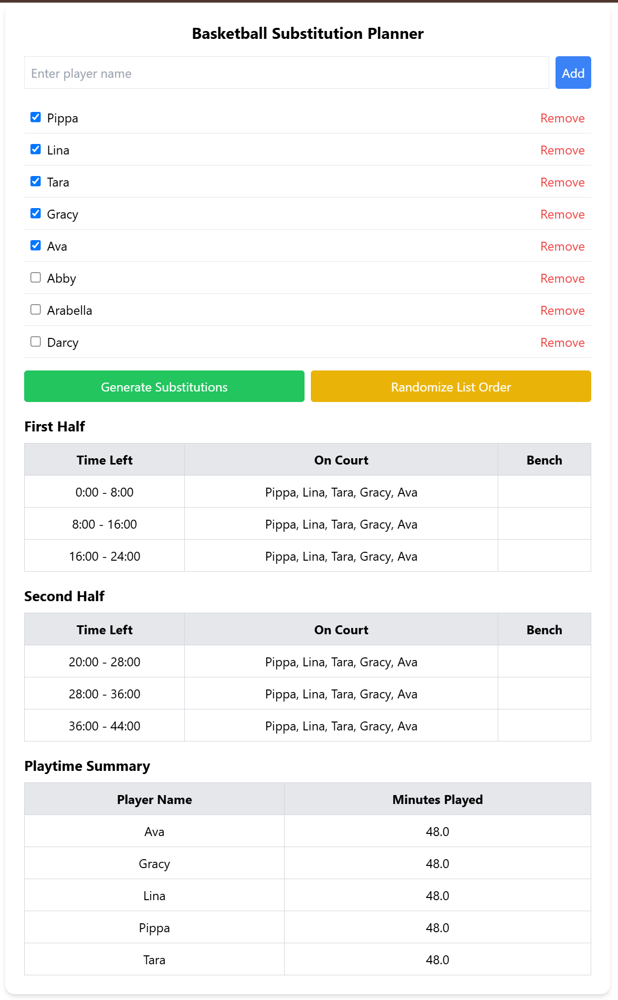

# Basketball Rotation Manager

Basketball Rotation Manager is a web application designed to help coaches manage player rotations during a basketball game. It calculates and displays the playtime for each player, ensuring fair and efficient use of the team.

## Features

- **Player Rotation Management**: Automatically rotates players on and off the court based on specified intervals.
- **Playtime Tracking**: Accurately tracks and displays the playtime for each player.
- **User-Friendly Interface**: Easy-to-use interface for setting up and managing rotations.

## Screenshot


## Installation

1. **Clone the repository**:
   ```bash
   git clone https://github.com/yourusername/basketball-rotation-manager.git
   cd basketball-rotation-manager
   ```

2. **Install dependencies**:
   ```bash
   npm install
   ```

3. **Run the application**:
   ```bash
   npm start
   ```

4. Open your browser and navigate to `http://localhost:3000` to view the application.

## Usage

1. **Set Up Players**: Enter the list of players and specify the number of active players on the court.
2. **Configure Rotations**: Set the duration for each rotation and start the game.
3. **Monitor Playtime**: View the playtime summary for each player in real-time.

## Contributing

Contributions are welcome! Please follow these steps:

1. Fork the repository.
2. Create a new branch (`git checkout -b feature/YourFeature`).
3. Commit your changes (`git commit -m 'Add some feature'`).
4. Push to the branch (`git push origin feature/YourFeature`).
5. Open a pull request.

## License

This project is licensed under the MIT License. See the [LICENSE](LICENSE) file for details.

